# Complete Workflow: Phase-Change Cooling Potential Analysis

## Overview

This document explains the **entire workflow** of the phase-change cooling potential analysis tool, from data loading to final report generation, including how each function works.

## High-Level Flowchart

```mermaid
flowchart TD
    Start([Start Analysis]) --> LoadData[1. Load Input Data]
    
    LoadData --> LoadPower[Load Power Consumption<br/>Lastgang Excel File<br/>Output: Standortverbrauch kW]
    LoadData --> LoadSolar[Load Solar Radiation<br/>CAMS CSV File<br/>Output: GHI W/m²]
    LoadData --> LoadPrices[Load Spot Market Prices<br/>API or CSV<br/>Output: Spot Market Price €/MWh]
    
    LoadPower --> ProcessData[2. Process & Align Data<br/>Resample to 15-min intervals<br/>Align indices, fill gaps]
    LoadSolar --> ProcessData
    LoadPrices --> ProcessData
    
    ProcessData --> CalcPV[3. Calculate PV Power<br/>Input: Solar GHI, PV Array Config<br/>Output: PV Power kW]
    CalcPV --> ConfigSystem[4. Configure Cooling Systems<br/>Input: System specs from config.py]
    
    ConfigSystem --> CalcProperties[Calculate System Properties<br/>U-value from insulation<br/>Heat Capacity = mass times c<br/>Output: U W/K, C J/K, Temp limits]
    CalcProperties --> CreateSchedule[5. Create Temperature Schedule]
    
    CreateSchedule --> NormalizePrices[Normalize Prices<br/>Input: Spot Market Prices<br/>Output: Normalized 0-1 range]
    
    NormalizePrices --> CalcTargetTemps[Calculate Target Temperatures<br/>Formula: min_temp + normalized_price times range<br/>Low price = Cold temp more cooling<br/>High price = Warm temp less cooling]
    
    CalcTargetTemps --> ApplyPCM[Apply PCM Temperature Preference<br/>Input: Phase change temp<br/>Output: Adjusted targets near PCM temp]
    
    ApplyPCM --> ApplyRamps[Apply Ramp Rate Constraints<br/>Input: Cooling/warming ramp rates<br/>Output: Feasible temperature schedule]
    
    ApplyRamps --> ScheduleDone[Temperature Schedule Complete<br/>Output: Schedule Temp °C]
    
    ScheduleDone --> PVOptimize{PV Available?}
    PVOptimize -->|Yes| PVOpt[6. PV Self-Consumption Optimization<br/>Cool more during PV surplus<br/>Output: Optimized Schedule]
    PVOptimize -->|No| CalcCooling[7. Calculate Cooling Power]
    PVOpt --> CalcCooling
    
    CalcCooling --> CalcHeatTransfer[Calculate Heat Transfer<br/>Input: U-value, wall area, temp diff<br/>Output: Sensible heat transfer W]
    
    CalcHeatTransfer --> CalcHeatCapacity[Calculate Heat Capacity Load<br/>Input: Mass, specific heat, temp change rate<br/>Output: Heat capacity load W]
    
    CalcHeatCapacity --> ApplyPCMModel[Apply Enhanced PCM Model<br/>Input: Temp, temp history, PCM params<br/>Output: PCM cooling benefit W]
    
    ApplyPCMModel --> ConvertToElectrical[Convert to Electrical Power<br/>Formula: electrical = load / COP<br/>Output: Electrical Power kW]
    
    ConvertToElectrical --> ElectricalLoad[Electrical Load Profile<br/>Output: Cooling Power After Optimization<br/>This is the LOAD PROFILE!]
    
    ElectricalLoad --> CalcCosts[8. Calculate Costs & Savings]
    
    CalcCosts --> CalcEVU[Calculate EVU After Optimization<br/>EVU_after = EVU_before - cooling_before + cooling_after]
    
    CalcEVU --> CalcGridPower[Calculate Grid Power<br/>Grid = max of 0 and EVU - PV<br/>Output: Grid Power kW]
    
    CalcGridPower --> CalcEnergyCost[Calculate Energy Cost<br/>Formula: sum of power times price times time<br/>Output: Energy Cost €]
    
    CalcEnergyCost --> CalcPowerCost[Calculate Power Cost<br/>Formula: max_power times power_price<br/>Output: Power Cost €]
    
    CalcPowerCost --> CalcSavings[Calculate Savings<br/>Savings = cost_before - cost_after<br/>Output: Savings € and %]
    
    CalcSavings --> Validate[9. Validate Temperature Schedule]
    
    Validate --> SimulateTemp[Simulate Temperature<br/>Input: Cooling power, outside temp<br/>Output: Simulated temperature °C]
    
    SimulateTemp --> CompareTarget[Compare with Target Schedule<br/>Error = simulated - target]
    
    CompareTarget --> CalcErrors[Calculate Validation Errors<br/>MAE = mean absolute error<br/>Max Error = maximum error<br/>RMSE = root mean square error]
    
    CalcErrors --> GenerateReports[10. Generate Reports]
    
    GenerateReports --> ExcelReport[Excel Reports<br/>results.xlsx: All time series data<br/>savings.xlsx: Summary metrics]
    
    GenerateReports --> HTMLReports[HTML Reports<br/>comprehensive_analysis.html<br/>cost_comparison.html<br/>energy_consumption_comparison.html<br/>grid_power_comparison.html]
    
    GenerateReports --> ValidationReport[Validation Report<br/>Temperature errors<br/>MAE, Max Error, RMSE<br/>Within tolerance %]
    
    ExcelReport --> End([End: Analysis Complete])
    HTMLReports --> End
    ValidationReport --> End
    
    style Start fill:#1A1A1A,color:#FFFFFF
    style LoadData fill:#2C3E50,color:#FFFFFF
    style CreateSchedule fill:#1E8449,color:#FFFFFF
    style CalcCooling fill:#922B21,color:#FFFFFF
    style CalcCosts fill:#6C3483,color:#FFFFFF
    style GenerateReports fill:#B9770E,color:#FFFFFF
    style ElectricalLoad fill:#7D3C98,color:#FFFFFF
    style End fill:#1A1A1A,color:#FFFFFF
```



## Detailed Step-by-Step Workflow

### Step 1: Load Input Data

**Function**: Data loading (in run scripts, e.g., `run_48h_may_2024_analysis.py`)

**What it does:**
1. **Load Power Consumption** (Lastgang Excel file)
   - Reads Excel file with columns: `Datum`, `Uhrzeit`, `Wert [kW]`
   - Combines date and time into datetime index
   - Renames to `Standortverbrauch` (gross consumption)
   - Filters for analysis period
   - Resamples to 15-minute intervals

2. **Load Solar Radiation** (CAMS CSV file)
   - Reads CSV with solar irradiance data (GHI - Global Horizontal Irradiance)
   - Aligns with power data index
   - Fills missing values

3. **Load Spot Market Prices** (API or CSV)
   - Fetches from API or reads from CSV
   - Aligns with power data index
   - Resamples to 15-minute intervals

**Output**: DataFrame with columns:
- `Standortverbrauch` (gross consumption, kW)
- `GHI` (solar irradiance, W/m²)
- `Spot Market Price (€/MWh)`

---

### Step 2: Process & Align Data

**Function**: Data alignment (in run scripts)

**What it does:**
1. **Align indices**: Ensure all data has same datetime index
2. **Resample**: Convert to 15-minute frequency
3. **Fill missing values**: Interpolate gaps
4. **Remove duplicates**: Keep first occurrence

**Output**: Aligned DataFrame with consistent 15-minute intervals

---

### Step 3: Calculate PV Power

**Function**: `calculate_pv_power_from_irradiance_multiple_arrays()` (in `utils/data_processing.py`)

**What it does:**
1. **For each PV array**:
   - Calculate solar position (azimuth, elevation)
   - Calculate irradiance on tilted surface
   - Account for shading, efficiency losses
   - Calculate DC power output

2. **Sum all arrays**: Total PV power = sum of all arrays

**Input**: Solar irradiance (GHI), PV array configuration
**Output**: `PV Power` (kW) column

**Formula**:
```
PV_power = GHI × array_area × efficiency × shading_factor × ...
```

---

### Step 4: Configure Cooling Systems

**Function**: System configuration (in run scripts)

**What it does:**
1. **Load system specifications** from `config.py`:
   - Room area, insulation thickness, content mass
   - Temperature limits (min, max, default)
   - PCM parameters (if applicable)

2. **Calculate system properties**:
   - **U-value**: Heat transfer coefficient (W/(m²·K))
     ```python
     U = calculate_heat_transfer_coefficient(insulation_thickness, insulation_type)
     U = U × calibration_factor  # Apply calibration
     ```
   - **Heat capacity**: Mass × specific heat (J/K)
     ```python
     heat_capacity = (content_mass + air_mass) × specific_heat_capacity
     ```
   - **Overall heat transfer coefficient**: U × Area (W/K)
     ```python
     overall_U = sum(U_i × area_i for all walls)
     ```

**Output**: System properties dictionary:
- `mapping_of_walls_properties`: `{"walls": {"area": ..., "heat_transfer_coef": ...}}`
- `mapping_of_content_properties`: `{"content": {"mass": ..., "specific_heat_capacity": ...}}`
- Temperature limits: `min_temp_allowed`, `max_temp_allowed`, `dflt_indoor_temp`

---

### Step 5: Create Temperature Schedule

**Function**: Schedule creators (in `analysis/schedule_creators.py` or `analysis/cost_aware_schedule_creator.py`)

**What it does:**

#### 5.1 Normalize Prices
```python
price_min = prices.min()
price_max = prices.max()
normalized_prices = (prices - price_min) / (price_max - price_min)
```
**Result**: Prices in 0-1 range (0 = lowest, 1 = highest)

#### 5.2 Calculate Target Temperatures

**For Price-Like Schedule** (heuristic):
```python
target_temp = min_temp + normalized_prices × (max_temp - min_temp)
```
**Logic**:
- Low price (normalized ≈ 0) → Cold temp (min_temp) → More cooling
- High price (normalized ≈ 1) → Warm temp (max_temp) → Less cooling

**For Cost-Aware Schedule** (greedy):
- Evaluates 20 temperature options
- Calculates score = price_benefit - energy_cost
- Selects option with highest score

#### 5.3 Apply PCM Temperature Preference
```python
if phase_change_temp is not None:
    # Prefer operating near phase change temperature
    if target_temp is near phase_change_temp:
        adjust target_temp towards phase_change_temp
```

#### 5.4 Apply Ramp Rate Constraints
```python
for each time step:
    change = target_temp - previous_temp
    if abs(change) > max_change_per_step:
        change = sign(change) × max_change_per_step
    schedule[i] = previous_temp + change
```
**Logic**: Limits temperature change rate (e.g., 2 K/h)

**Output**: `Temperature Schedule` column (°C)

---

### Step 6: PV Self-Consumption Optimization (Optional)

**Function**: `optimize_pv_self_consumption()` (in `analysis/pv_self_consumption_optimizer.py`)

**What it does:**
1. **Identify surplus phases**: When PV > Site consumption
2. **Adjust schedule**: Cool more during surplus phases (use free PV energy)
3. **Respect constraints**: Still respect ramp rates and temperature limits

**Output**: Modified `Temperature Schedule` (optimized for PV self-consumption)

---

### Step 7: Calculate Cooling Power

**Function**: `calculate_phase_change_cooling_power()` (in `analysis/phase_change_models.py`)

**What it does:**

#### 7.1 Calculate Heat Transfer Load
```python
temp_deviation = default_temp - schedule_temp
heat_transfer_load = U × area × temp_deviation
```
**Logic**: 
- If schedule_temp < default_temp: Need MORE cooling (positive load)
- If schedule_temp > default_temp: Need LESS cooling (negative load)

#### 7.2 Calculate Heat Capacity Load
```python
temp_change_rate = dT/dt
capacity_load = mass × specific_heat × temp_change_rate
```
**Logic**: 
- When temperature is changing, need additional power to change heat capacity
- Cooling (negative change) = positive load needed

#### 7.3 Apply Enhanced PCM Model
```python
if pcm_mass > 0:
    pcm_benefit = calculate_enhanced_pcm_cooling_benefit(
        temp=schedule_temp,
        temp_history=previous_temps,
        phase_change_temp=phase_change_temp,
        ...
    )
    total_load = heat_transfer + capacity - pcm_benefit
```
**Logic**: PCM reduces required cooling (provides "free" cooling)

#### 7.4 Convert to Electrical Power
```python
electrical_power = (baseline_cooling + additional_load) / (COP × latent_heat_factor)
```
**Formula**: `Power = Cooling_Load / COP`

**Output**: `Cooling Power After Optimization` column (kW) - **This is the electrical load profile!**

---

### Step 8: Calculate Costs & Savings

**Function**: Cost calculation (in `analysis/phase_change_analysis_tool.py`)

**What it does:**

#### 8.1 Calculate EVU After Optimization
```python
EVU_after = EVU_before - cooling_power_before + cooling_power_after
```
**Logic**: Replace old cooling power with new optimized cooling power

#### 8.2 Calculate Site Consumption
```python
site_consumption_after = EVU_after  # Gross consumption
```

#### 8.3 Calculate Grid Power
```python
if PV available:
    EVU_meter_after = EVU_after - PV_power  # Net grid exchange
    grid_power_after = max(0, EVU_meter_after)  # Only when drawing from grid
else:
    grid_power_after = EVU_after
```

#### 8.4 Calculate Energy Cost
```python
energy_cost = sum(power × price × time_step)
```
**Formula**: `Cost = Σ(Power × Price × Δt)`

#### 8.5 Calculate Power Cost
```python
max_power = max(grid_power)
power_cost = max_power × power_price
```
**Formula**: `Power Cost = Max Power × Power Price`

#### 8.6 Calculate Total Cost
```python
total_cost = energy_cost + power_cost
```

#### 8.7 Calculate Savings
```python
savings = cost_before - cost_after
savings_percent = (savings / cost_before) × 100
```

**Output**: Cost comparison and savings metrics

---

### Step 9: Validate Temperature Schedule

**Function**: `validate_temperature_schedule()` (in `analysis/temperature_validation.py`)

**What it does:**

#### 9.1 Simulate Temperature
```python
simulated_temp = simulate_temperature_from_cooling_power(
    cooling_power=electrical_power,
    outside_temp=estimated_outside_temp,
    initial_temp=default_temp,
    ...
)
```
**Logic**: 
- Uses thermal model to simulate temperature from cooling power
- Accounts for heat transfer, heat capacity, PCM

#### 9.2 Compare with Target
```python
errors = simulated_temp - target_schedule_temp
```

#### 9.3 Calculate Validation Metrics
```python
MAE = mean(abs(errors))  # Mean Absolute Error
Max_Error = max(abs(errors))  # Maximum Error
RMSE = sqrt(mean(errors²))  # Root Mean Square Error
Within_Tolerance = (abs(errors) < tolerance).sum() / len(errors)  # Percentage
```

**Output**: Validation report with error metrics

---

### Step 10: Generate Reports

**Function**: Report generation (in `analysis/phase_change_analysis_tool.py`)

**What it does:**

#### 10.1 Excel Reports
- **`results.xlsx`**: All time series data (temperatures, powers, prices, costs)
- **`savings.xlsx`**: Summary of savings (energy, cost, percentages)

#### 10.2 HTML Reports
- **`comprehensive_analysis.html`**: Overview plots
- **`cost_comparison.html`**: Cost comparison charts
- **`energy_consumption_comparison.html`**: Energy comparison
- **`grid_power_comparison.html`**: Grid power comparison
- **`before_optimization.html`**: Baseline analysis
- **`before_optimization_with_price.html`**: Baseline with prices

#### 10.3 Validation Report
- **Temperature validation**: Errors, MAE, Max Error, RMSE
- **Within tolerance**: Percentage of time within tolerance

**Output**: Complete analysis package

---

## Key Functions Explained

### 1. `create_price_like_schedule()`

**Location**: `analysis/schedule_creators.py`

**Purpose**: Create temperature schedule based on energy prices

**Algorithm**:
1. Normalize prices to 0-1 range
2. Map to temperatures: `target = min + normalized × (max - min)`
3. Apply PCM preference (if applicable)
4. Apply ramp rate constraints

**Input**: Prices, temperature limits, ramp rates
**Output**: Temperature schedule (°C)

---

### 2. `calculate_phase_change_cooling_power()`

**Location**: `analysis/phase_change_models.py`

**Purpose**: Convert temperature schedule to electrical load profile

**Algorithm**:
1. Calculate heat transfer load: `U × A × ΔT`
2. Calculate heat capacity load: `m × c × dT/dt`
3. Apply PCM benefits: `enhanced_pcm_cooling_benefit()`
4. Convert to electrical power: `load / COP`

**Input**: Temperature schedule, system properties, PCM parameters
**Output**: Electrical load profile (kW)

---

### 3. `calculate_enhanced_pcm_cooling_benefit()`

**Location**: `analysis/enhanced_pcm_model.py`

**Purpose**: Calculate PCM cooling benefits (phase change + thermal buffering)

**Algorithm**:
1. Calculate phase fraction: `fraction = f(temp, phase_change_temp)`
2. Calculate effective heat capacity: `C_eff = C_sensible + C_latent × fraction`
3. Calculate thermal buffering: `buffering = f(temp_history, temp_change_rate)`
4. Calculate proximity effect: `proximity = exp(-|temp - phase_change_temp| / range)`
5. Calculate total benefit: `benefit = buffering × (1 + proximity) + base_benefit`

**Input**: Temperature, temperature history, PCM parameters
**Output**: PCM cooling benefit (kW reduction)

---

### 4. `simulate_temperature_from_cooling_power()`

**Location**: `analysis/temperature_validation.py`

**Purpose**: Simulate temperature from cooling power (for validation)

**Algorithm**:
1. For each time step:
   - Calculate heat transfer: `Q_transfer = U × A × (T_out - T_in)`
   - Calculate heat capacity: `Q_capacity = m × c × dT/dt`
   - Calculate PCM effects: `Q_pcm = pcm_benefit()`
   - Energy balance: `Q_cooling = Q_transfer + Q_capacity - Q_pcm`
   - Update temperature: `T_new = T_old + (Q_cooling - Q_cooling_system) / (m × c)`

**Input**: Cooling power, outside temperature, system properties
**Output**: Simulated temperature (°C)

---

### 5. `optimize_pv_self_consumption()`

**Location**: `analysis/pv_self_consumption_optimizer.py`

**Purpose**: Optimize schedule to use PV surplus energy

**Algorithm**:
1. Identify surplus phases (PV > consumption)
2. For each surplus phase:
   - Cool more during surplus (use free PV energy)
   - Respect ramp rates and temperature limits
3. Return optimized schedule

**Input**: Temperature schedule, surplus phases, constraints
**Output**: Optimized temperature schedule

---

## Data Flow Diagram

```
┌─────────────────────────────────────────────────────────────┐
│ INPUT DATA                                                 │
│ - Power consumption (Lastgang)                            │
│ - Solar radiation (CAMS)                                  │
│ - Spot market prices (API/CSV)                             │
└───────────────────────┬───────────────────────────────────┘
                        │
                        ▼
┌─────────────────────────────────────────────────────────────┐
│ PROCESSED DATA                                              │
│ - Aligned 15-minute intervals                               │
│ - PV power calculated                                       │
│ - System properties calculated                              │
└───────────────────────┬───────────────────────────────────┘
                        │
                        ▼
┌─────────────────────────────────────────────────────────────┐
│ TEMPERATURE SCHEDULE                                        │
│ - Price-based optimization                                 │
│ - PV self-consumption optimization (optional)              │
│ - Ramp rate constraints applied                            │
└───────────────────────┬───────────────────────────────────┘
                        │
                        ▼
┌─────────────────────────────────────────────────────────────┐
│ COOLING POWER CALCULATION                                   │
│ - Heat transfer load                                        │
│ - Heat capacity load                                        │
│ - PCM benefits                                              │
│ - Convert to electrical power                               │
└───────────────────────┬───────────────────────────────────┘
                        │
                        ▼
┌─────────────────────────────────────────────────────────────┐
│ COST CALCULATION                                            │
│ - Energy cost (power × price × time)                        │
│ - Power cost (max power × power price)                      │
│ - Savings calculation                                       │
└───────────────────────┬───────────────────────────────────┘
                        │
                        ▼
┌─────────────────────────────────────────────────────────────┐
│ VALIDATION                                                  │
│ - Simulate temperature from cooling power                   │
│ - Compare with target schedule                              │
│ - Calculate errors (MAE, Max, RMSE)                         │
└───────────────────────┬───────────────────────────────────┘
                        │
                        ▼
┌─────────────────────────────────────────────────────────────┐
│ OUTPUT REPORTS                                              │
│ - Excel: results.xlsx, savings.xlsx                        │
│ - HTML: Comprehensive plots and visualizations              │
│ - Validation: Temperature error analysis                    │
└─────────────────────────────────────────────────────────────┘
```

## Summary

### The Complete Process:

1. **Load Data**: Power, solar, prices
2. **Process Data**: Align, resample, fill gaps
3. **Calculate PV**: From solar radiation
4. **Configure Systems**: Calculate U-value, heat capacity
5. **Create Schedule**: Price-based temperature optimization
6. **PV Optimization**: (Optional) Optimize for PV self-consumption
7. **Calculate Power**: Convert temperature to electrical load
8. **Calculate Costs**: Energy + power costs, savings
9. **Validate**: Simulate and compare temperatures
10. **Generate Reports**: Excel, HTML, validation

### Key Outputs:

- **Temperature Schedule**: Optimized temperature profile (°C)
- **Electrical Load Profile**: `Cooling Power After Optimization` (kW)
- **Cost Savings**: Energy and cost savings (€, %)
- **Validation Report**: Temperature error analysis

The entire workflow is automated and runs from a single script (e.g., `run_48h_may_2024_analysis.py`).

